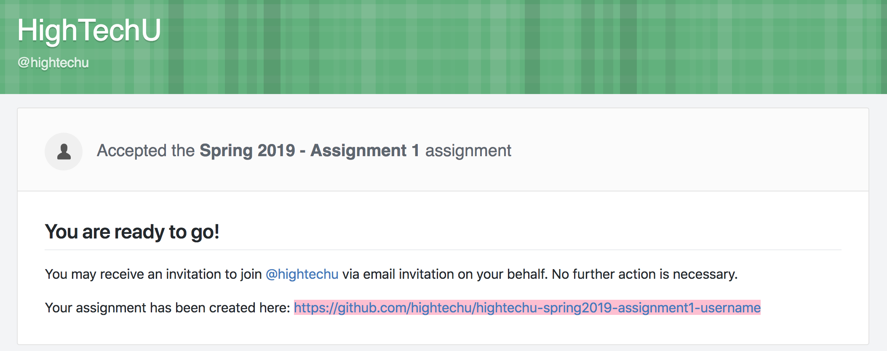

# Assignment 1

1. Signin to [GitHub](https://github.com/login)

2. Head over to  and accept the GitHub Classroom Assignment.

3. After accepting the assignment you will have your own GitHub repository. This is the repository that you will do your assignment in. Make sure to bookmark the URL (link) so you can get back to it easily. 

**This assignment is due before class next week.**
